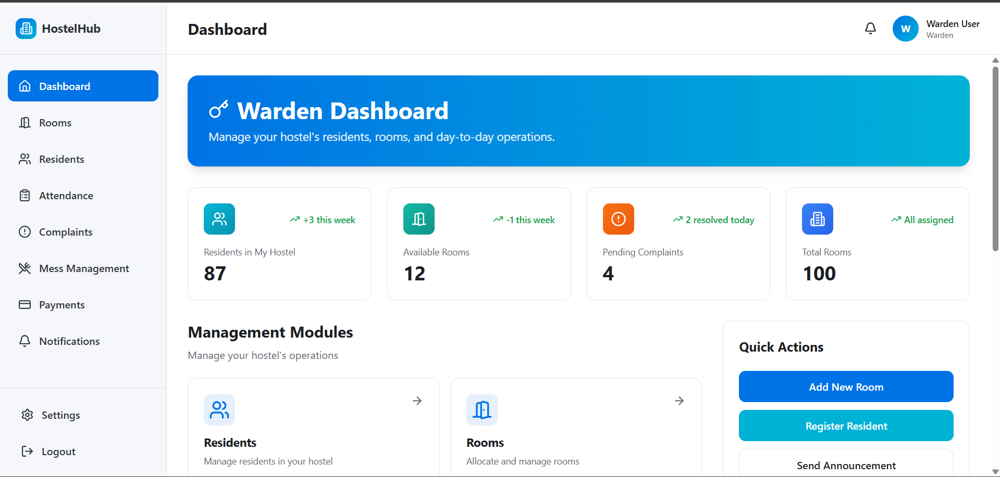
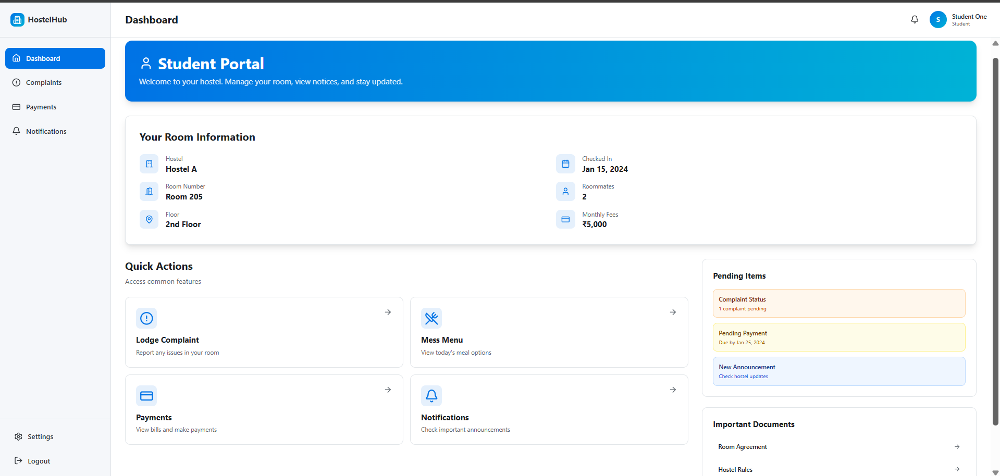

# 🏨 HostelHub — Full Stack Hostel Management System

HostelHub is a modern and comprehensive **full-stack hostel management system** built for Admins, Wardens, and Residents.  
It provides end-to-end digital management of hostels, including room allocation, attendance, complaints, dashboards, payments, and more.

This project includes:

- A **React + Vite** modern frontend  
- An **Express.js + MongoDB** fully secured backend  
- Authentication, authorization, dashboards, and analytics  
- Role-based access for **Admin**, **Warden**, and **Resident**  

---

## 🚀 Tech Stack

### **Frontend**
- React (Vite)
- TypeScript
- Tailwind CSS
- React Query
- Zustand
- Axios

### **Backend**
- Express.js
- TypeScript
- MongoDB + Mongoose
- JWT Authentication
- Role-Based Access Control (RBAC)

### **Development Tools**
- Vite Dev Server
- Express Middleware Integration
- ESLint + Prettier
- Nodemon

---

## 📌 Project Features

### 🔐 **Authentication & Roles**
- Secure login using JWT  
- Three user roles:
  - **Admin**  
  - **Warden**  
  - **Resident**

---

## 📊 **Admin Features**
- Full control of the system  
- Manage hostels  
- Manage all users (wardens, residents)  
- View system-wide dashboards:
  - Total hostels  
  - Active residents  
  - Rooms available  
  - Complaint statistics  
- Add new hostels  
- Manage room allocations  

---

## 🧑‍🏫 **Warden Features**
- Manage assigned hostel  
- Add or remove residents  
- Allocate or free rooms  
- Manage complaints  
- Mark attendance for residents  
- View hostel-specific dashboards:
  - Resident count  
  - Available rooms  
  - Pending complaints  
  - Total rooms  

---

## 🧑‍🎓 **Resident Features**
- View hostel details & room information  
- File complaints  
- View complaint status  
- Check attendance history  
- Access mess menu, notifications, payments  
- View important documents  

---

## 🛏 **Hostel & Room Management**
- Create hostels  
- Assign wardens  
- Create rooms  
- Allocate beds to residents  
- Automatic availability tracking  
- Real-time updates in dashboards  

---

## 📅 **Attendance Management**
- Wardens mark attendance  
- Admin can view full attendance  
- Auto date-based storage  
- Residents can view their own records  

---

## 🚨 **Complaint Management**
- Residents can file complaints  
- Wardens/Admin track and update statuses  
- Status: `pending`, `in-progress`, `resolved`  
- Dashboard displays summary  

---

## 💬 **Mess & Payments Modules**
- Manage mess menu  
- Track payments  
- Show pending dues  
- Resident-friendly UI  

---

## 📸 Screenshots

### 🟦 **Admin Dashboard**


### 🟩 **Warden Dashboard**


### 🟨 **Resident Portal**


---

## ⚙️ Installation

### **Clone the Repository**
```bash
git clone https://github.com/yourusername/hostelhub.git
cd hostelhub
